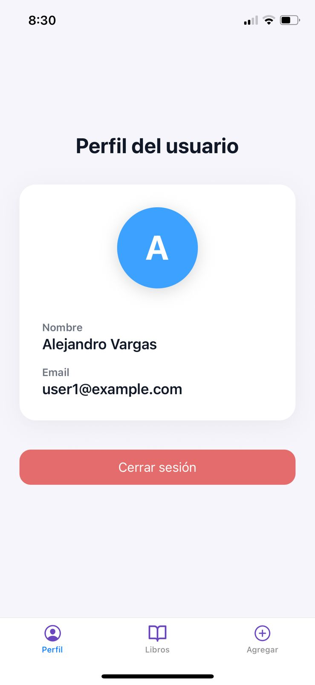

# App de evaluación (React Native, Expo + TypeScript)

Aplicación pequeña que combina un login ligero con una lista de tareas asociada a cada usuario. Las tareas requieren título, foto y ubicación, y se guardan localmente para que se muestren únicamente al usuario que las creó.

## Requisitos

- Node >= 16
- npm
- Expo (se puede usar con `npx`, no hace falta instalación global)

## Instalación

Desde la carpeta del proyecto ejecuta:

```
npm install
```

## Ejecutar en desarrollo

```
npx expo start
```

Abre el emulador o la app Expo Go para probar la aplicación.

## Qué incluye la app

- Login con validación sobre dos usuarios permitidos (`user1@example.com`, `user2@example.com`, contraseña `1234`).
- Persistencia de sesión en `AsyncStorage` para conservar el estado entre reinicios.
- Lista de tareas (`app/home.tsx`) asociada al usuario autenticado; cada tarea requiere título, toma de foto (expo-image-picker) y ubicación actual (expo-location).
- Funcionalidades para marcar tareas como completadas, eliminarlas y navegar de vuelta al login con un botón de cerrar sesión.

## Cómo probar (casos clave)

1. Abre la app y autentícate con uno de los usuarios válidos (`user1@example.com` o `user2@example.com`, contraseña `1234`).
2. En la pantalla de tareas completa el formulario: agrega un título, selecciona una imagen y permite el acceso a la ubicación.
3. Confirma que la nueva tarea aparece con su foto y coordenadas; alterna su estado entre completada/pendiente y elimina alguna para validar el borrado.
4. Cierra sesión y vuelve a iniciar con el mismo usuario; las tareas deben permanecer gracias a AsyncStorage.

## Estructura relevante

- `app/index.tsx` — Login y lógica de redirección.
- `app/home.tsx` — Lista de tareas con creación, marcado, eliminación y logout.
- `components/context/auth-context.tsx` — Controla el estado del usuario y mantiene la sesión usando AsyncStorage.
- `constants/types.ts` — Tipos `User`, `Task` y la ubicación de la tarea.
- `utils/storage.ts` — Helpers para guardar/cargar tareas y sesión del usuario.

## Dependencias clave

- `@react-native-async-storage/async-storage` — Persistencia local de tareas y sesión.
- `expo-image-picker` — Selección de fotos desde la galería.
- `expo-location` — Captura las coordenadas al crear una tarea.

## Notas

- Al ejecutar `npm run lint` se validan las reglas recomendadas por Expo.
- La navegación está construida con Expo Router (un stack con login y home, sin pestañas).

## Capturas de pantalla
<p align="center">
  
  
  
</p>

<p align="center">
  
  
</p>


## Video de Demostración
https://www.youtube.com/watch?v=Dgk6rK0fi7o 
